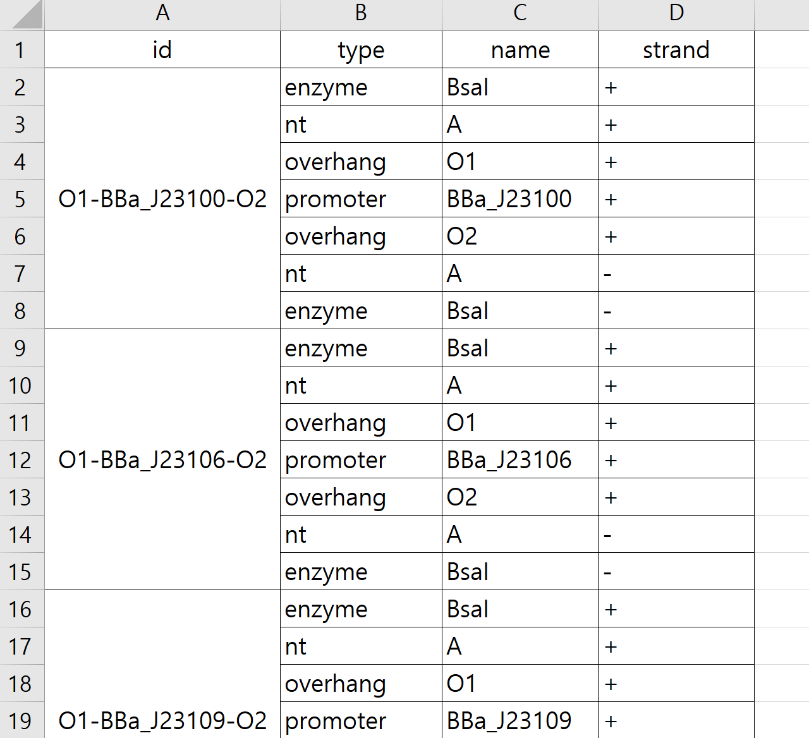
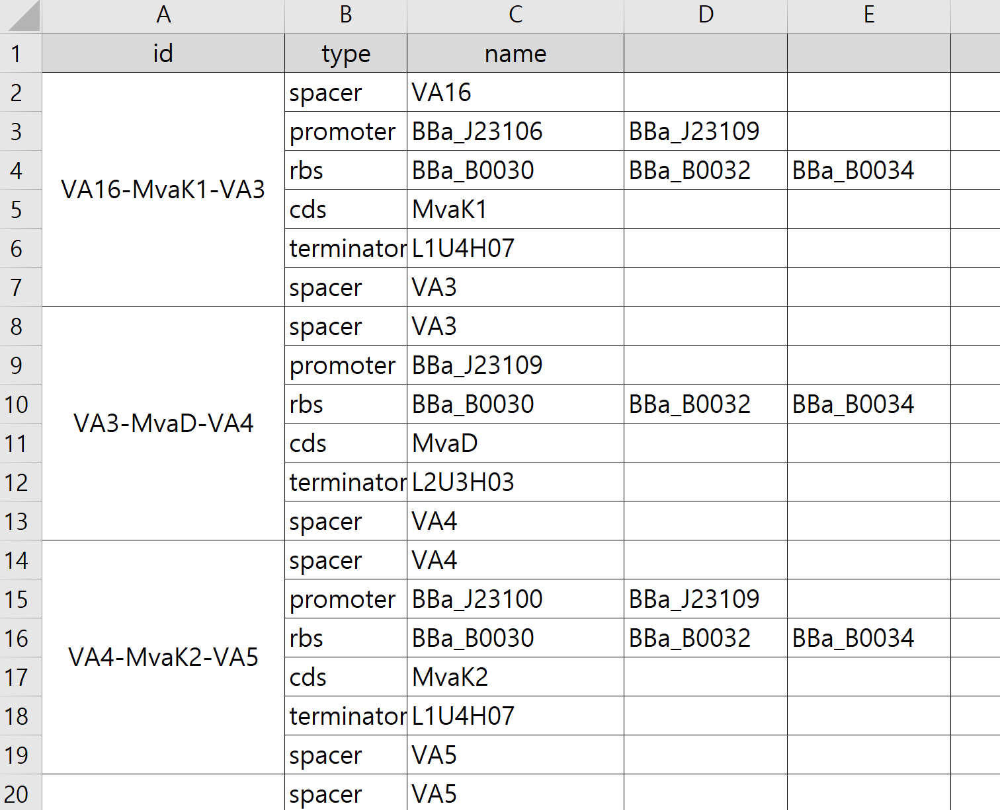
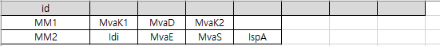
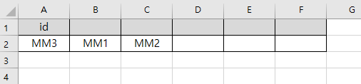
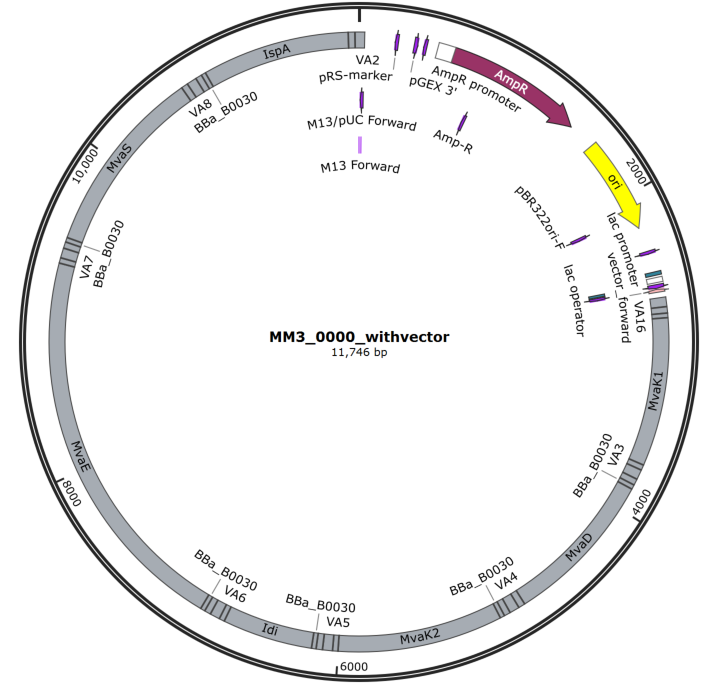

# Combinatorial Design Microservice

FastAPI 기반 DNA 조합 어셈블리 설계 마이크로서비스.  
Part 서열 + Module 설계를 입력받아 GoldenGate / Gibson 어셈블리 시뮬레이션을 수행하고 결과를 JSON + GenBank(base64)로 반환합니다.

Partbank26(`partbank26/backend`)에서 HTTP로 호출되며, Docker Compose로 독립 컨테이너(`combinatorial`)로 실행됩니다.

---

## 목차

1. [아키텍처](#아키텍처)
2. [빠른 시작 (Docker)](#빠른-시작-docker)
3. [API 레퍼런스](#api-레퍼런스)
4. [GoldenGate 어셈블리 로직](#goldengate-어셈블리-로직)
5. [오류 / 경고 메시지 해설](#오류--경고-메시지-해설)
6. [Partbank26 연동](#partbank26-연동)
7. [테스트](#테스트)
8. [주요 변경 이력](#주요-변경-이력)
9. [레거시 사용법 (Jupyter 스크립트)](#레거시-사용법-jupyter-스크립트)

---

## 아키텍처

```
Partbank26 Backend (FastAPI :8000)
    └─ POST /api/v1/combinatorial/run
           │  part_ids → DB 조회 → 서열 resolve
           ▼
Combinatorial Microservice (FastAPI :8001)
    └─ POST /run
           │
           ├─ [GoldenGate] prepare_goldengate_fragments()
           │      파트별 BsaI 사이트 감지 / 래핑
           │
           ├─ filter_combinations_by_overhang()
           │      인접 슬롯 오버행 일치 여부로 조합 필터링
           │
           └─ assemble_goldengate()
                  BsaI 절단 → pydna Assembly → circular/linear
                  결과: sequence, GenBank(base64), primers, features
```

**핵심 라이브러리**
- `pydna` 5.2.0 — DNA 조립 시뮬레이션 (`Assembly`, `terminal_overlap`, `cut`)
- `biopython` 1.84 — 서열 처리, GenBank I/O, 제한효소(`BsaI`)
- `primers` 0.5.10 — 프라이머 설계

---

## 빠른 시작 (Docker)

### 사전 요구사항

- `assets/pUC19.gb` — 기본 벡터 파일 (없으면 모든 요청에 `vector_sequence` 필수)

### 개발 환경 실행

```bash
# partbank26 루트에서
docker compose -f docker-compose.dev.yml up combinatorial -d

# 재빌드 (api.py 변경 후)
bash scripts/rebuild-combinatorial.sh
```

### 헬스체크

```bash
curl http://localhost:8001/health
# {"status": "ok"}
```

---

## API 레퍼런스

### `GET /health`

서비스 상태 확인.

**Response**
```json
{"status": "ok"}
```

---

### `POST /run`

조합 어셈블리 시뮬레이션 실행.

#### Request Body

```json
{
  "project_name": "string",
  "assembly_method": "goldengate",
  "vector_sequence": "ATCG...",
  "vector_overhang_left": "AAAA",
  "vector_overhang_right": "TCAC",
  "parts": [...],
  "modules": [...]
}
```

| 필드 | 타입 | 필수 | 설명 |
|------|------|------|------|
| `project_name` | string | ✅ | 프로젝트 식별자 |
| `assembly_method` | `"goldengate"` \| `"gibson"` | — | 기본값: `"goldengate"` |
| `vector_sequence` | string | — | 벡터 DNA 서열. 미제공 시 `assets/pUC19.gb` 사용 |
| `vector_overhang_left` | string | — | 벡터 좌측 접합 오버행 (4 nt). 첫 번째 파트 `overhang_left`와 일치해야 함. 미지정 시 검증 생략 |
| `vector_overhang_right` | string | — | 벡터 우측 접합 오버행 (4 nt). 마지막 파트 `overhang_right`와 일치해야 함. 미지정 시 검증 생략 |
| `parts` | `PartInput[]` | ✅ | 파트 목록 |
| `modules` | `ModuleInput[]` | ✅ | 모듈 설계 |

#### PartInput

```json
{
  "id": "p1",
  "kid": "KBp_a0001",
  "name": "T7_promoter",
  "type": "Promoter",
  "sequence": "TAATACGACTCACTATA",
  "direction": "forward",
  "overhang_left": "GGAG",
  "overhang_right": "CTTT"
}
```

| 필드 | 설명 |
|------|------|
| `name` | GenBank LOCUS 이름으로 사용. 공백은 `_`로 자동 치환 |
| `type` | 슬롯 타입과 다르면 경고 (조립은 계속 진행) |
| `overhang_left` | BsaI 절단 후 파트 왼쪽 4 nt sticky end |
| `overhang_right` | BsaI 절단 후 파트 오른쪽 4 nt sticky end |

#### ModuleInput / ModuleSlot

```json
{
  "id": "MM1",
  "slots": [
    {"type": "Promoter",   "part_names": ["T7_promoter"]},
    {"type": "RBS",        "part_names": ["T7_RBS", "B0034"]},
    {"type": "CDS",        "part_names": ["sfGFP"]},
    {"type": "Terminator", "part_names": ["T7_terminator"]}
  ]
}
```

- 슬롯 내 파트가 2개 이상이면 조합 폭발(combinatorial expansion) 수행
- `part_names`의 파트는 `parts` 배열에 반드시 존재해야 함

#### Response Body

```json
{
  "combinations": [
    {
      "id": "MM1_T7_promoter-T7_RBS-sfGFP-T7_terminator",
      "sequence": "ATCG...",
      "length": 1234,
      "genbank_b64": "TE9DVVMg...",
      "primers": [
        {"target": "T7_promoter", "direction": "forward", "sequence": "ATCG...", "tm": 58.3, "length": 20}
      ],
      "features": [
        {"label": "T7_promoter", "start": 0, "end": 17, "strand": 1}
      ]
    }
  ],
  "total_combinations": 2,
  "errors": [
    "MM1_T7_promoter-B0034-sfGFP-T7_terminator: 벡터 내 BsaI 사이트 1개 발견 — 시뮬레이션을 위해 자동 치환됨"
  ]
}
```

**`errors` 배열 구조**

- `{combo_key}: ...` — 특정 조합에서 발생한 오류/경고
- 콤보 키 미포함 — 전체 공통 오류 (파트 미발견, 벡터 읽기 실패 등)

**GenBank 디코딩 예시 (Python)**

```python
import base64
gb_text = base64.b64decode(result["genbank_b64"]).decode()
```

---

## GoldenGate 어셈블리 로직

### 1단계: 파트 준비 (`prepare_goldengate_fragments`)

각 파트를 BsaI 절단 가능한 `-withvector.gb` 파일로 변환합니다.

**Case A — 파트에 BsaI 사이트 2개 정확히 존재 (`GGTCTC` + `GAGACC`)**
1. 기존 BsaI 사이트 사이 서열 추출
2. 실제 오버행이 슬롯 설정(`overhang_left`/`overhang_right`)과 일치하는지 검증
3. 불일치 시 → Case B 낙오 처리 (경고 기록)

**Case B — BsaI 사이트 없거나 오버행 불일치**

```
GGTCTCA[OHL][sequence][OHR]TGAGACC
```

래핑 후 접합부(`OHL+seq[:6]`, `seq[-6:]+OHR`)에서 우발적 BsaI 사이트 생성 여부 자동 검사.

**오류 처리**
- BsaI 사이트 3개 이상 → 해당 파트 제외
- 우발적 접합부 BsaI → 경고 + 조립 진행 (결과 부정확 가능)

파일명 형식: `{OHL}-{part_name}-{OHR}-withvector.gb`

### 2단계: 조합 필터링 (`filter_combinations_by_overhang`)

```
Slot 1: [OHL1-P1-OHR1]  →  OHR1 == OHL2 ?
Slot 2: [OHL2-P2-OHR2]  →  OHR2 == OHL3 ?
Slot 3: [OHL3-P3-OHR3]
```

인접 슬롯 간 오버행이 연속적으로 일치하는 조합만 통과.  
조합 ID: `{module.id}_{part1}-{part2}-{part3}`

### 3단계: 어셈블리 (`assemble_goldengate`)

각 유효 조합에 대해:

1. 각 파트 `-withvector.gb` 로드 → BsaI 절단 → 가장 긴 fragment 선택
2. 벡터 제공 시:
   - 벡터 내 BsaI 사이트 자동 치환 (`GGTCTC→GGTCTG`, `GAGACC→GAGACG`)
   - 벡터 래핑: `GGTCTCA[OHR_last][vector][OHL_first]TGAGACC`
   - `vector_overhang_left`/`vector_overhang_right` 지정 시 오버행 일치 검증 후 불일치 조합 제외
   - BsaI 절단 → 벡터 backbone fragment 획득
   - **원형(circular) 조립** 수행
3. 벡터 미제공 시: 선형(linear) 조립
4. 결과 feature 정리: BsaI 마커, 오버행 레이블, 범위 오류 feature 제거

**오버행 연결 구조**

```
[vector] ─── OHL_first ───► [Part1] ─── OHR1/OHL2 ───► [Part2] ─── OHR_last ─── [vector]
```

---

## 오류 / 경고 메시지 해설

| 메시지 | 원인 | 영향 |
|--------|------|------|
| `벡터 내 BsaI 사이트 N개 발견 — 시뮬레이션을 위해 자동 치환됨` | 벡터 서열에 BsaI 인식 서열 존재 | 시뮬레이션 자동 보정. **실험 시 벡터 수정 필요** |
| `[경고] {part}: 슬롯 타입 'X'에 파트 타입 'Y'이 배치됨` | 슬롯 타입과 파트의 실제 타입 불일치 | 조립 계속 진행. 설계 확인 권장 |
| `[경고] {part}: OHR 'XX' + 서열 3' 말단에서 의도치 않은 BsaI 사이트 N개 생성` | 파트 서열 말단과 오버행 결합 시 우발적 `GAGACC`/`GGTCTC` 형성 | 해당 파트를 포함한 조합 결과 부정확 가능. **오버행 변경 권장** |
| `{combo}: 벡터 좌측/우측 오버행 불일치` | `vector_overhang_left`/`right`가 파트 실제 오버행과 다름 | 해당 조합 제외 |
| `{combo}: no BsaI site found in {gbfile}` | BsaI 절단 후 fragment 없음 | 해당 조합 제외 |
| `{combo}: circular assembly produced no candidates` | pydna `assemble_circular()` 후보 없음 | 해당 조합 제외. 오버행 연속성 재확인 필요 |
| `Part 'X' not found in request` | `module.slots[].part_names`에 있는 파트가 `parts` 배열에 없음 | 해당 파트 제외 |

### 우발적 BsaI 사이트 발생 패턴 주의

`AGGAGA`로 끝나는 서열(예: 일부 RBS) + `CC`로 시작하는 OHR 조합:

```
...AGGAGA + CCXX  →  AGGAGACC  →  GAGACC (BsaI 역방향 인식!)
```

`CC`로 시작하는 OHR 대신 `TCAC`, `GCAG`, `AATG` 등 사용 권장.

---

## Partbank26 연동

백엔드 프록시 위치: `backend/app/presentation/api/v1/combinatorial.py`

**동작 흐름**
1. 사용자 요청에서 `part_ids` 수신
2. DB에서 파트 서열 조회 (권한 검사 포함)
3. 슬롯의 `overhang_left`/`overhang_right`를 해당 슬롯의 모든 파트에 적용
4. `vector_id` 제공 시 벡터 서열 DB 조회
5. 마이크로서비스 `/run`으로 포워딩

**Partbank RunRequest 스키마**

```json
{
  "project_name": "my_project",
  "assembly_method": "goldengate",
  "vector_id": "<vector_db_id>",
  "vector_overhang_left": "GGAG",
  "vector_overhang_right": "TCAC",
  "modules": [
    {
      "id": "MM1",
      "slots": [
        {
          "type": "Promoter",
          "part_ids": ["<partbank_id_1>", "<partbank_id_2>"],
          "overhang_left": "GGAG",
          "overhang_right": "CTTT"
        }
      ]
    }
  ]
}
```

> **주의**: 슬롯의 `overhang_left`/`overhang_right`는 해당 슬롯 내 모든 파트에 동일하게 적용됩니다.  
> 파트별로 오버행이 다른 경우 별도 슬롯으로 분리하세요.

---

## 테스트

```bash
# Docker 컨테이너 내에서 전체 실행
docker exec partbank-combinatorial-dev python -m pytest tests/ -v

# 테스트 클래스별 실행
docker exec partbank-combinatorial-dev python -m pytest tests/test_api_integration.py::TestBsaiCutBehavior -v
docker exec partbank-combinatorial-dev python -m pytest tests/test_api_integration.py::TestCircularGoldenGateAssembly -v
docker exec partbank-combinatorial-dev python -m pytest tests/test_api_integration.py::TestPartTypeMismatchWarning -v
docker exec partbank-combinatorial-dev python -m pytest tests/test_api_integration.py::TestVectorOverhangValidation -v
```

**테스트 클래스 목록** (총 28개)

| 클래스 | 설명 |
|--------|------|
| `TestHealthEndpoint` | 헬스체크 |
| `TestRunInputValidation` | 입력 검증 (빈 파트, 필수 필드 등) |
| `TestRunAssembly` | 기본 조립, 2×2 조합 확장, 프라이머 검증 |
| `TestBsaiCutBehavior` | `_wrap_with_bsai`, BsaI 절단 fragment 검증 |
| `TestCircularGoldenGateAssembly` | 2파트/4파트 원형 조립, 벡터 포함 조립 |
| `TestPartTypeMismatchWarning` | 슬롯-파트 타입 불일치 경고 |
| `TestVectorOverhangValidation` | 벡터 오버행 검증 (일치/불일치/미지정) |

---

## 주요 변경 이력

### v2.0 (2026-04) — FastAPI 마이크로서비스화

기존 Jupyter notebook 기반 스크립트를 FastAPI REST API로 전환.

| 항목 | 내용 |
|------|------|
| **BsaI 사이트 감지** | 기존 BsaI 사이트 2개 파트 자동 인식 및 오버행 검증 |
| **벡터 circular 조립** | 벡터 backbone 포함 `assemble_circular()` 지원 |
| **내부 BsaI 자동 치환** | 벡터 내 BsaI 사이트 시뮬레이션용 자동 치환 |
| **우발적 접합부 BsaI 감지** | 파트 서열 말단 + OHR 결합 시 BsaI 생성 여부 자동 검사 |
| **파트 타입 불일치 경고** | 슬롯 타입 vs 파트 실제 타입 비교 경고 |
| **벡터 오버행 검증** | `vector_overhang_left`/`right` 지정 시 불일치 조합 제외 |
| **feature 정리** | 조립 후 BsaI 마커, 오버행 레이블, 범위 오류 feature 자동 제거 |
| **조합별 에러 분리** | `errors[]`의 `{combo_key}:` prefix로 프론트엔드 카드별 표시 |
| **TDD** | 28개 통합 테스트 (pydna 실제 실행, mock 없음) |

---

## 레거시 사용법 (Jupyter 스크립트)

> 아래는 v1.0 Jupyter 기반 스크립트 사용법입니다. 현재는 FastAPI 마이크로서비스(`api.py`)가 주 인터페이스입니다.

<details>
<summary>펼치기</summary>

### 사용법

```bash
git clone git@github.com:sblabkribb/combinatorial_design.git
cd combinatorial_design
```

- `projects/` 하위에 프로젝트 폴더 생성 (예: `haseong_240704`)
- `assembly_design.xlsx` 복사 후 편집
  - 시트1: part 디자인
  - 시트2: module 디자인
  - 시트3: multi-module 디자인
  - 시트4: pathway 디자인
- 파트 정보는 `PartDB-kribb.xlsx` 참조

### 파트 준비

```python
import part_preparation as pprep
project_dir = "haseong_240704"
pprep.part_insert_goldengate(project_dir, "assembly_design.xlsx")
pprep.part_withvector_gibson(project_dir, "pUC19.gb", "MCS")
```

### 모듈 조립

```python
import part_assembly as pasm
allcomb = pasm.get_all_possible_combinations(project_dir, "assembly_design.xlsx")
module_linear = pasm.part_assembly_goldengate(project_dir, allcomb)
module_withvector = pasm.build_module_withvector_gibson(project_dir, "pUC19.gb", module_linear)
```

### 멀티모듈 / 경로 조립

```python
import module_assembly as masm
assembly_linear = masm.module_combinatorial_gibson_assembly(project_dir, "assembly_design.xlsx")
assembly_circular = masm.module_comb_withvector_gibson_assembly(project_dir, "pUC19.gb", assembly_linear)
all_pathways = masm.pathway_comb_withvector_gibson_assembly(project_dir, "assembly_design.xlsx", "pUC19.gb", assembly_linear)
```

</details>

## 1. 사용법 간단한 설명
- 임의의 폴더 위치에서 다음 입력 (command line)
- git clone git@github.com:sblabkribb/combinatorial_design.git
- combinatorial_design 폴더 이동
- 원하는 프로젝트 이름으로 projects 폴더 안에 하위폴더를 (예를 들어 `haseong_240704`) 만들고 `assembly_design.xlsx` 파일을 복사해서 해당 프로젝트 폴더에 붙여넣음
- 프로젝트 폴더의 `assembly_design.xlsx` 파일을 열고 
  - 첫번째 시트의 part 디자인
  - 두번째 시트의 module 디자인 (single module)
  - 세번째 시트의 multi module 디자인
  - 네번째 시트의 pathway 디자인 (multi-module + multi-module)
- 참고로 부품 정보는 엑셀파일 (`PartDB-kribb.xlsx`)에 있음 
- 각 프로젝트 폴더에 생성되는 genbank 파일은 변경하지 않는 것이 좋으며 만약 임의로 변경하여 사용하고 싶을경우 복사하여 별도 디렉토리에서 관리
- 세부 사용법은 아래 참고
  - 3-A 부품설계
  - 3-B 모듈설계
  - 3-C 멀티모듈 설계
  - 3-D 경로설계
- python (ipynb) 실행을 위해서는 conda 환경을 만든 후 env.yaml 파일로 환경 구축후 실행 가능
- vscode 환경에서 수행 가능

## 2. 부품 정보 관리

- `PartDB-kribb.xlsx`
- 순수 서열정보만 저장

## 3-A. 부품 설계 

- Golden gate 수행 가능한 상태의 part 단위의 정보 (genbank 파일) 준비 과정
- 부품 실물은 본 시뮬레이션과는 다르게 duplex 형태로 저장될 수 있음
- 해당 정보는 genbank file로 프로젝트 폴더 하위 part 폴더에 저장 

### 설계 방법 
- part 서열에 enzyme site와 overhang 등을 붙여서 golden gate assembly 수행 되도록 설계
- 설계된 파일은 insert로 먼저 준비되고 이 후 vector에 저장됨 
  - pUC19 vector에 저장됨을 가정함 (genbank/addgene-plasmid-50005-sequence-222046.gbk) 
  - 실제로 각 부품들은 overhang과 enzyme site가 붙어서 duplex 형태로 저장되므로 (주문 약 10~30만원, 1000배 희석, 0.1 microl/회 사용) 이 후 시뮬레이션 과정은 실제로 수행되지 않음. 본 시뮬레이션은 genbank 파일을 작성하기 위한 과정으로 이해 
- 준비된 part 정보는 [id 이름].gb으로 `parts/insert` 디렉토리에 저장

{width=500px}

### Insert 
- excel file에서 설계된 대로 insert 서열을 만들로 genbank 파일 생성
- `project_dir`에 프로젝트 이름 (앞서 만든 폴더 이름) 저장
- part_preparation.py 파일에 구현


```python
import part_preparation as pprep
from importlib import reload
reload(pprep)

project_dir = "haseong_240704"
design_file = "assembly_design.xlsx"
vector_gbfile = "addgene-plasmid-50005-sequence-222046.gb"

pprep.part_insert_goldengate(project_dir, design_file)
```

    Process completed. GenBank files have been created in the folder of c:\mydocs\2024\dev\combinatorial_design\projects\haseong_240704\parts\insert
    

### Inserting the part in a vector
- Gibson을 활용한 insert - vector에 클로닝 (gbfile 얻기 위한 시뮬레이션)
- `parts/insert` 폴더에 있는 모든 insert genbank 파일에 대해서 자동 수행
- pUC19의 MCS 서열과 교환 삽입
  - 교환 삽입은 pydna에서 지원하지 않아 enzyme cut 후 pcr 수행하는 방법으로 진행
- genbank 파일은 `parts/withvector` 폴더에 저장
- Gibson 위한 각 insert용 primer 서열 자동 생성 및 project 폴더에 저장 `primers-part-withvector-gibson.csv`
- pydna의 assembly후 insert의 feature 위치가 적절히 업데이트 되지 않는 문제로 관련 fix 포함


```python
import part_preparation as pprep
from importlib import reload
reload(pprep)

pprep.part_withvector_gibson(project_dir, vector_gbfile, "MCS")
```

    Process completed. GenBank files have been created in the folder of c:\mydocs\2024\dev\combinatorial_design\projects\haseong_240704\parts\withvector
    

## 3-B. 모듈 설계 

- 앞서 만든 part 디렉토리의 부품들로 모듈 제작하는 과정 
- 앞서 만든 part들로 한정됨
- 동일 id에 속한 부품들이 조합되어 하나의 linear DNA를 만듦
- 조립된 하나의 모듈은 insert로서 벡터에 저장되며 genbank 파일로 정보 저장
- genbank 파일은 엑셀파일에 지정된 id를 파일이름으로 `module` 디렉토리에 저장 
- part_assembly.py 에 구현



### All combination generation

- 위 디자인 파일에서 보듯 사용자의 편의를 위해 부품들의 이름만으로 설계를 수행함
- 그러나 같은 이름을 같는 다른 DNA 서열이 있을 수 있음 
  - 예를 들어 BBa_J23100의 경우 앞 뒤 오버행이 다르게 붙은 형태로 O1-BBa_J23100-O2-withvector.gb 파일과 O2-BBa_J23100-O3-withvector.gb 파일이 같은 BBa_J23100 부품으로 취급될 수 있음
- 이러한 문제로 연결부위에 공통 오버행을 갖는 부품들로만 구성되어 있는 조합을 필터링하는 기능을 수행
- 어셈블리 시뮬레이션으로 실제 어셈블리 예측 검증하고 최종 gb 파일 `module` 폴더 저장
- 자동 생성된 primer 리스트는 project 폴더에 저장


```python
import part_assembly as pasm
from importlib import reload
reload(pasm)

allcomb = pasm.get_all_possible_combinations(project_dir, design_file)
```

### 설계된 조합별로 Linear DNA 조립 Goldengate Assembly
- 앞서 만들어진 부품 조합들을 goldengate assembly로 linear dna 만들기
- genbank file 저장


```python
import part_assembly as pasm
import pandas as pd 
from importlib import reload
reload(pasm)
from pydna.all import read

## goldengate assembly with the filtered combinations
## 
module_linear = pasm.part_assembly_goldengate(project_dir, allcomb)

```


<font face=monospace><a href='c:\mydocs\2024\dev\combinatorial_design\projects\haseong_240704\modules\inserts/VA8-BBa_J23106-BBa_B0032-IspA-L2U3H03-VA2.gb' target='_blank'>c:\mydocs\2024\dev\combinatorial_design\projects\haseong_240704\modules\inserts/VA8-BBa_J23106-BBa_B0032-IspA-L2U3H03-VA2.gb</a></font><br>


### 조합된 Linear DNA를 vector에 클로닝 Gibson assembly
- Assume pUC19 is used for the vector
- project 폴더에 primer 저장


```python
import part_assembly as pasm
import pandas as pd 
from importlib import reload
reload(pasm)

module_withvector_list = pasm.build_module_withvector_gibson(project_dir, vector_gbfile, module_linear)
```


<font face=monospace><a href='c:\mydocs\2024\dev\combinatorial_design\projects\haseong_240704\modules\withvector/VA8-BBa_J23106-BBa_B0032-IspA-L2U3H03-VA2_withvector.gb' target='_blank'>c:\mydocs\2024\dev\combinatorial_design\projects\haseong_240704\modules\withvector/VA8-BBa_J23106-BBa_B0032-IspA-L2U3H03-VA2_withvector.gb</a></font><br>


## 3-C. 모듈 어셈블리 기반 다중 모듈 설계
- 각 모듈들의 조합에 대해서 gibson assembly 이용한 linear DNA 만들기
- assembly_design.xlsx 파일 multi-module 텝에서 디자인 
- 아래 이미지와 같이 ID를 임의로 넣고 원하는 조합의 유전자(CDS)를 명시함 
- 해당 유전자들이 포함된 모든 조합에 대해서 linear DNA 먼저 생성 
- pathways/insert/[modulename] 에 gbfile 생성
- module_assembly.py에 구현
- project folder에 primer 파일 저장





```python
import module_assembly as masm
from importlib import reload
reload(masm)

assembly_linear_dict = masm.module_combinatorial_gibson_assembly(project_dir, design_file)

```


<font face=monospace><a href='c:\mydocs\2024\dev\combinatorial_design\projects\haseong_240704\pathways\inserts\MM2\MM2_0015.gb' target='_blank'>c:\mydocs\2024\dev\combinatorial_design\projects\haseong_240704\pathways\inserts\MM2\MM2_0015.gb</a></font><br>


- 주어진 vector에 gibson으로 삽입한 상태의 circular DNA 제작
- pathways/withvector/MMxx에 genbank 파일 저장


```python
import module_assembly as masm
from importlib import reload
reload(masm)

assembly_circular_dict = masm.module_comb_withvector_gibson_assembly(project_dir, vector_gbfile, assembly_linear_dict)

```


<font face=monospace><a href='c:\mydocs\2024\dev\combinatorial_design\projects\haseong_240704\pathways\withvector\MM2\MM2_0015_withvector.gb' target='_blank'>c:\mydocs\2024\dev\combinatorial_design\projects\haseong_240704\pathways\withvector\MM2\MM2_0015_withvector.gb</a></font><br>


## 3-D. 대사경로 조합
- 위 두 개 이상의 모듈이 조합된 대사경로들에 대해서 서로 모든 조합으로 조립하는 과정
- 멀티 모듈은 앞서 만든 모듈 이름으로 디자인
- 수행 전 앞서 `module_combinatorial_gibson_assembly` 함수와 `module_comb_withvector_gibson_assembly` 먼저 실행 필수 (멀티모듈들을 먼저 만들어 두어야 함) 
- assembly_design.xlsx 파일의 pathway 시트에서 디자인
- pathways/withvector/[module name]에 gbfile 생성
- module_assembly.py에 구현
- project folder에 primer 저장




```python
import module_assembly as masm
from importlib import reload
reload(masm)

all_pathway_combination_list = masm.pathway_comb_withvector_gibson_assembly(project_dir, design_file, vector_gbfile, assembly_linear_dict)


```


<font face=monospace><a href='c:\mydocs\2024\dev\combinatorial_design\projects\haseong_240704\pathways\withvector\MM3\MM3_0010_withvector.gb' target='_blank'>c:\mydocs\2024\dev\combinatorial_design\projects\haseong_240704\pathways\withvector\MM3\MM3_0010_withvector.gb</a></font><br>


- 최종 7개 유전자 조합, 11kbp vector map 자동 완성


