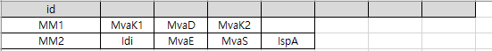

# Combinatorial Part Design


- 부품/모듈 조합을 설계하고 genbank 및 fasta 파일 생성하는 프로그램
- 설계는 엑셀로 (`assembly_design.xlsx`) 수행하고 이를 기반으로 genbank 및 fasta 파일을 생성

## 1. 사용법 간단한 설명
- 임의의 폴더 위치에서 다음 입력 (command line)
- git clone git@github.com:sblabkribb/combinatorial_design.git
- combinatorial_design 폴더 이동
- 원하는 프로젝트 이름으로 projects 폴더 안에 하위폴더를 (예를 들어 `haseong_240704`) 만들고 `assembly_design.xlsx` 파일을 복사해서 해당 프로젝트 폴더에 붙여넣음
- 프로젝트 폴더의 `assembly_design.xlsx` 파일을 열고 
  - 첫번째 시트의 part 디자인
  - 두번째 시트의 module 디자인 (single module)
  - 세번째 시트의 multi module 디자인
  - 네번째 시트의 pathway 디자인 (multi-module + multi-module)
- 참고로 부품 정보는 엑셀파일 (`PartDB-kribb.xlsx`)에 있음 
- 각 프로젝트 폴더에 생성되는 genbank 파일은 변경하지 않는 것이 좋으며 만약 임의로 변경하여 사용하고 싶을경우 복사하여 별도 디렉토리에서 관리
- 세부 사용법은 아래 참고
  - 3-A 부품설계
  - 3-B 모듈설계
  - 3-C 멀티모듈 설계
  - 3-D 경로설계
- python (ipynb) 실행을 위해서는 conda 환경을 만든 후 env.yaml 파일로 환경 구축후 실행 가능
- vscode 환경에서 수행 가능

## 2. 부품 정보 관리

- `PartDB-kribb.xlsx`
- 순수 서열정보만 저장

## 3-A. 부품 설계 

- Golden gate 수행 가능한 상태의 part 단위의 정보 (genbank 파일) 준비 과정
- 부품 실물은 본 시뮬레이션과는 다르게 duplex 형태로 저장될 수 있음
- 해당 정보는 genbank file로 프로젝트 폴더 하위 part 폴더에 저장 

### 설계 방법 
- part 서열에 enzyme site와 overhang 등을 붙여서 golden gate assembly 수행 되도록 설계
- 설계된 파일은 insert로 먼저 준비되고 이 후 vector에 저장됨 
  - pUC19 vector에 저장됨을 가정함 (genbank/addgene-plasmid-50005-sequence-222046.gbk) 
  - 실제로 각 부품들은 overhang과 enzyme site가 붙어서 duplex 형태로 저장되므로 (주문 약 10~30만원, 1000배 희석, 0.1 microl/회 사용) 이 후 시뮬레이션 과정은 실제로 수행되지 않음. 본 시뮬레이션은 genbank 파일을 작성하기 위한 과정으로 이해 
- 준비된 part 정보는 [id 이름].gb으로 `parts/insert` 디렉토리에 저장

{width=500px}

### Insert 
- excel file에서 설계된 대로 insert 서열을 만들로 genbank 파일 생성
- `project_dir`에 프로젝트 이름 (앞서 만든 폴더 이름) 저장
- part_preparation.py 파일에 구현


```python
import part_preparation as pprep
from importlib import reload
reload(pprep)

project_dir = "haseong_240704"
design_file = "assembly_design.xlsx"
vector_gbfile = "addgene-plasmid-50005-sequence-222046.gb"

pprep.part_insert_goldengate(project_dir, design_file)
```

    Process completed. GenBank files have been created in the folder of /home/haseong/dev/combinatorial_design/projects/haseong_240704/parts/insert


### Inserting the part in a vector
- Gibson을 활용한 insert - vector에 클로닝 (gbfile 얻기 위한 시뮬레이션)
- `parts/insert` 폴더에 있는 모든 insert genbank 파일에 대해서 자동 수행
- pUC19의 MCS 서열과 교환 삽입
  - 교환 삽입은 pydna에서 지원하지 않아 enzyme cut 후 pcr 수행하는 방법으로 진행
- genbank 파일은 `parts/withvector` 폴더에 저장
- Gibson 위한 각 insert용 primer 서열 자동 생성 및 project 폴더에 저장 `primers-part-withvector-gibson.csv`
- pydna의 assembly후 insert의 feature 위치가 적절히 업데이트 되지 않는 문제로 관련 fix 포함


```python
import part_preparation as pprep
from importlib import reload
reload(pprep)

pprep.part_withvector_gibson(project_dir, vector_gbfile, "MCS")
```

    Process completed. GenBank files have been created in the folder of /home/haseong/dev/combinatorial_design/projects/haseong_240704/parts/withvector


## 3-B. 모듈 설계 

- 앞서 만든 part 디렉토리의 부품들로 모듈 제작하는 과정 
- 앞서 만든 part들로 한정됨
- 동일 id에 속한 부품들이 조합되어 하나의 linear DNA를 만듦
- 조립된 하나의 모듈은 insert로서 벡터에 저장되며 genbank 파일로 정보 저장
- genbank 파일은 엑셀파일에 지정된 id를 파일이름으로 `module` 디렉토리에 저장 
- part_assembly.py 에 구현


### All combination generation

- 위 디자인 파일에서 보듯 사용자의 편의를 위해 부품들의 이름만으로 설계를 수행함
- 그러나 같은 이름을 같는 다른 DNA 서열이 있을 수 있음 
  - 예를 들어 BBa_J23100의 경우 앞 뒤 오버행이 다르게 붙은 형태로 O1-BBa_J23100-O2-withvector.gb 파일과 O2-BBa_J23100-O3-withvector.gb 파일이 같은 BBa_J23100 부품으로 취급될 수 있음
- 이러한 문제로 연결부위에 공통 오버행을 갖는 부품들로만 구성되어 있는 조합을 필터링하는 기능을 수행
- 어셈블리 시뮬레이션으로 실제 어셈블리 예측 검증하고 최종 gb 파일 `module` 폴더 저장
- 자동 생성된 primer 리스트는 project 폴더에 저장


```python
import part_assembly as pasm
from importlib import reload
reload(pasm)

allcomb = pasm.get_all_possible_combinations(project_dir, design_file)
```

### 설계된 조합별로 Linear DNA 조립 Goldengate Assembly
- 앞서 만들어진 부품 조합들을 goldengate assembly로 linear dna 만들기
- genbank file 저장


```python
import part_assembly as pasm
import pandas as pd 
from importlib import reload
reload(pasm)
from pydna.all import read

## goldengate assembly with the filtered combinations
## 
module_linear = pasm.part_assembly_goldengate(project_dir, allcomb)

```


<font face=monospace><a href='/home/haseong/dev/combinatorial_design/projects/haseong_240704/modules/inserts/VA8-BBa_J23106-BBa_B0032-IspA-L2U3H03-VA2.gb' target='_blank'>/home/haseong/dev/combinatorial_design/projects/haseong_240704/modules/inserts/VA8-BBa_J23106-BBa_B0032-IspA-L2U3H03-VA2.gb</a></font><br>


### 조합된 Linear DNA를 vector에 클로닝 Gibson assembly
- Assume pUC19 is used for the vector
- project 폴더에 primer 저장


```python
import part_assembly as pasm
import pandas as pd 
from importlib import reload
reload(pasm)

module_withvector_list = pasm.build_module_withvector_gibson(project_dir, vector_gbfile, module_linear)
```


<font face=monospace><a href='/home/haseong/dev/combinatorial_design/projects/haseong_240704/modules/withvector/VA8-BBa_J23106-BBa_B0032-IspA-L2U3H03-VA2_withvector.gb' target='_blank'>/home/haseong/dev/combinatorial_design/projects/haseong_240704/modules/withvector/VA8-BBa_J23106-BBa_B0032-IspA-L2U3H03-VA2_withvector.gb</a></font><br>


## 3-C. 모듈 어셈블리 기반 다중 모듈 설계
- 각 모듈들의 조합에 대해서 gibson assembly 이용한 linear DNA 만들기
- assembly_design.xlsx 파일 multi-module 텝에서 디자인 
- 아래 이미지와 같이 ID를 임의로 넣고 원하는 조합의 유전자(CDS)를 명시함 
- 해당 유전자들이 포함된 모든 조합에 대해서 linear DNA 먼저 생성 
- pathways/insert/[modulename] 에 gbfile 생성
- module_assembly.py에 구현
- project folder에 primer 파일 저장





```python
import module_assembly as masm
from importlib import reload
reload(masm)

assembly_linear_dict = masm.module_combinatorial_gibson_assembly(project_dir, design_file)

```


<font face=monospace><a href='/home/haseong/dev/combinatorial_design/projects/haseong_240704/pathways/inserts/MM2/MM2_0015.gb' target='_blank'>/home/haseong/dev/combinatorial_design/projects/haseong_240704/pathways/inserts/MM2/MM2_0015.gb</a></font><br>


- 주어진 vector에 gibson으로 삽입한 상태의 circular DNA 제작
- pathways/withvector/MMxx에 genbank 파일 저장


```python
import module_assembly as masm
from importlib import reload
reload(masm)

assembly_circular_dict = masm.module_comb_withvector_gibson_assembly(project_dir, vector_gbfile, assembly_linear_dict)

```


<font face=monospace><a href='/home/haseong/dev/combinatorial_design/projects/haseong_240704/pathways/withvector/MM2/MM2_0015_withvector.gb' target='_blank'>/home/haseong/dev/combinatorial_design/projects/haseong_240704/pathways/withvector/MM2/MM2_0015_withvector.gb</a></font><br>


## 3-D. 대사경로 조합
- 위 두 개 이상의 모듈이 조합된 대사경로들에 대해서 서로 모든 조합으로 조립하는 과정
- 멀티 모듈은 앞서 만든 모듈 이름으로 디자인
- 수행 전 앞서 `module_combinatorial_gibson_assembly` 함수와 `module_comb_withvector_gibson_assembly` 먼저 실행 필수 (멀티모듈들을 먼저 만들어 두어야 함) 
- assembly_design.xlsx 파일의 pathway 시트에서 디자인
- pathways/withvector/[module name]에 gbfile 생성
- module_assembly.py에 구현
- project folder에 primer 저장


```python
import module_assembly as masm
from importlib import reload
reload(masm)

all_pathway_combination_list = masm.pathway_comb_withvector_gibson_assembly(project_dir, design_file, vector_gbfile, assembly_linear_dict)


```


<font face=monospace><a href='/home/haseong/dev/combinatorial_design/projects/haseong_240704/pathways/withvector/MM3/MM3_0010_withvector.gb' target='_blank'>/home/haseong/dev/combinatorial_design/projects/haseong_240704/pathways/withvector/MM3/MM3_0010_withvector.gb</a></font><br>


```python
all_pathway_combination_list[0].list_features()
```
